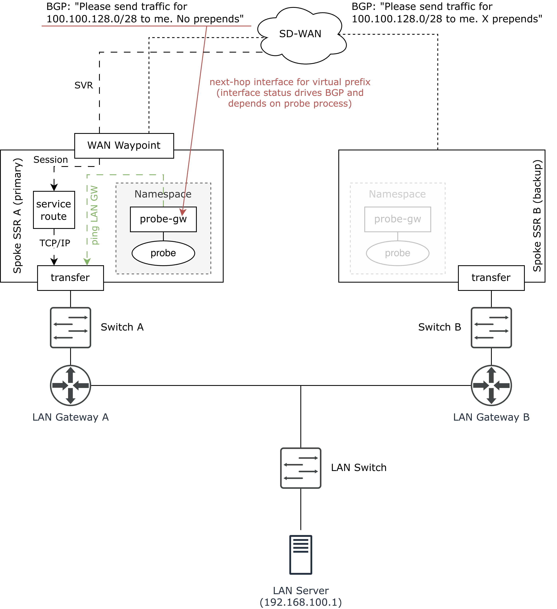

# ssr-icmp-probe-lan

ICMP-based LAN reachability tracking for dynamic BGP route advertisement in Juniper SSR.

## Overview

Traditional routing platforms support ICMP probing to track destination reachability (for example, a LAN gateway) and dynamically enable or disable static routes based on probe results.

Examples:

* [Juniper's RPM-tracked static routes](https://www.juniper.net/documentation/us/en/software/junos/flow-monitoring/topics/concept/real-time-performance-monitoring-overview.html#id-understanding-using-probes-for-realtime-performance-monitoring-on-m-t-ptx-and-mx-series-rout__subsection_nsx_m3r_zfc)
* [Cisco's Static Route Object Tracking](https://www.cisco.com/c/en/us/td/docs/switches/lan/c9000/lyr3-fwd/enhanced-object-tracking/enhanced-object-tracking-configuration-guide/static-route-object-tracking.html)

Juniper Session Smart Routing (SSR) provides [service-path monitoring via ICMP probes](https://www.juniper.net/documentation/us/en/software/session-smart-router/docs/config_service_health/#icmp-probe), but service-path state cannot directly influence BGP route advertisement or withdrawal.

This makes certain high-availability (HA) designs difficult to implement.

**ssr-icmp-probe-lan** bridges this gap.

It uses a virtual router interface (type `host`) whose operational state is controlled by the SSR plugin framework. The `ssr-icmp-probe-lan` daemon performs ICMP probing, and its results are fed back into SSR via a monitoring script that retrieves probe statistics through the API from the `ssr-icmp-probe-lan` daemon.

Because BGP advertisements can depend on interface state, this enables dynamic advertisement or withdrawal of BGP routes based on LAN reachability.

## Example Use Case

### Scenario

* Two routers (A and B) operate at a branch site
* Connected to an SSR SD-WAN (hub/spoke, optional partial mesh)
* Both advertise the branch prefix(es) via BGP-over-SVR
* Backup router uses:
	* AS-path prepending (eBGP), or
	* Lower local preference (iBGP)

### Failure Handling

* Primary router probes the LAN gateway via ICMP
* Probe results control the virtual interface `probe-gw`
* If probes fail:
	* `probe-gw` transitions to **down**
	* The BGP route (e.g. `100.100.128.0/28`) is withdrawn
* Optional: backup router performs the same probing logic
* Optional: DNAT/SNAT hides real LAN prefixes (e.g. 192.168.100.0/24)

The following diagram outlines how **ssr-icmp-probe-lan** is intended to work in this use case.




## Configuration

Configuration requires changes on the conductor (globally and at router level).

### Global Configuration

* Define a ping probe service (per branch site)
	* Recommended: restrict visibility to the specific router (reduces FIB usage)
* Define a LAN service (per branch site)
	* Recommended: restrict visibility similarly

### Router-Level Configuration

* Service-route for ping probe service
* Service-route for LAN service
* Virtual interface (type `host`)
	* Recommended tenant: `_internal_`
* Static route
	* Next-hop interface = virtual interface
	* Ensures BGP advertisement depends on interface state
* Optional:
	* Bidirectional NAT on transfer/LAN interface

### Override of LAN IP address

By default, the first gateway address of any interface prefixed with:

* `transfer`
* `lan`

is used as probe destination.

To override this, create the `/etc/128technology/ssr-icmp-probe-lan.yaml` configuration like:

```
echo 'destination: 1.2.3.4' | sudo tee /etc/128technology/ssr-icmp-probe-lan.yaml
```

Afterwards:

```
sudo systemctl restart ssr-icmp-probe-lan
```
or reboot the router.


### Sample SSR configuration

```
config
    authority
        router  branch1
            node  node0
                device-interface  transfer1
                    pci-address        0000:00:13.0
                    network-interface  transfer1
                        tenant              corp
                        address             192.168.0.254
                            prefix-length   24
                            gateway         192.168.0.1
                        exit
                        bidirectional-nat   192.168.100.0/29
                            remote-ip  100.100.128.0/29
                        exit
                        dynamic-source-nat  192.168.100.0/24
                            remote-ip  100.100.128.15/32
                        exit
                    exit
                exit
                device-interface  wan1
                    ...
                exit
                device-interface  probe-gw
                    type               host
                    network-namespace  probe-gw
                    network-interface  probe-gw
                        tenant     _internal_
                        address    192.168.128.1
                            prefix-length  30
                            gateway        192.168.128.2
                        exit
                    exit
                exit
            exit
            routing              default-instance
                interface         loopback_bgp
                    ...
                exit
                routing-protocol  bgp
                    ...
                    redistribute  static
                    exit
                exit
                static-route      100.100.128.0/28 254
                    distance            254
                    next-hop-interface  node0 probe-gw
                    exit
                exit
            exit
            service-route        local-network
                service-name  branch1.sites
                next-hop      node0 transfer1
                exit
            exit
            service-route        probe
                service-name  probe-branch1
                next-hop      node0 transfer1
                exit
            exit
        exit
        service                 sites
            description           "Template service to form sites hierarchy"
            security              app-sec
            access-policy         corp
            exit
            service-policy        failover-wan1-wan2-wan3-wan4
            share-service-routes  false
            application-type      template
        exit
        service                 branch1.sites
            address               100.100.128.0/28
            share-service-routes  false
        exit
        service                 probe-branch1
            address               192.168.0.1
            applies-to            router
                router-name  branch1
            exit
            access-policy         _internal_
            exit
            share-service-routes  false
        exit
    exit
exit

```


## Installation

The **ssr-icmp-probe-lan** application files must be installed on each SSR router node that requires the LAN ICMP probing.

First, place the following files on the conductor under /srv/salt:

* ssr-icmp-probe-lan.pyz
* ssr-icmp-probe-lan.sls
* ssr-icmp-probe-lan-monitor.py

For the installation there are two options:

### Automatic via `top.sls` (recommended)

Update the `top.sls` - all routers (asset-ids) must be referenced:

```
$ cat /srv/salt/top.sls
base:
  '*':
    - dummy
  'branch1':
    - ssr-icmp-probe-lan
# ...
```
The installation is performed automatically during the next salt highstate (for example, when the minion reconnects).

### Manual Installation

If not modifying `top.sls` - for example during tests:

```
$ sudo salt-call -l debug state.apply ssr-icmp-probe-lan
```

⚠ Manual installations must be repeated after router replacement (e.g. RMA).

## Troubleshooting

### 1. Virtual interface does not come up

Check if the destination address (LAN gateway) can be pinged from inside the network namespace:

```
$ sudo ip netns exec probe-gw ping <lan-gateway>
```

### 2. Pinging does not work

Check if the service and service-route from the virtual interface tenant (`_internal_`) are configured properly:

```
# show fib service-name branch1.sites
```

### 3. Configuration is correct but interface down

Check whether the LAN gateway is reachable from the SSR router at all:

```
# ping egress-interface transfer1 <lan-gateway>
```
