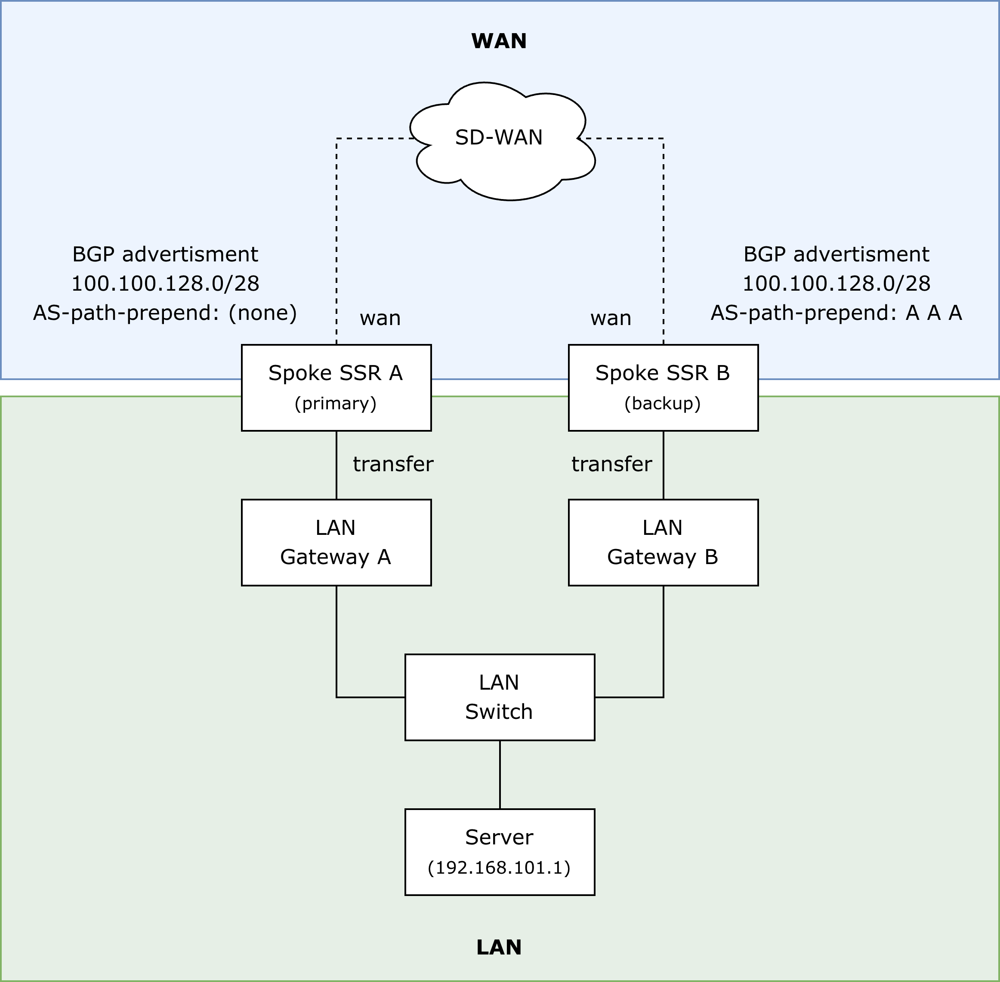
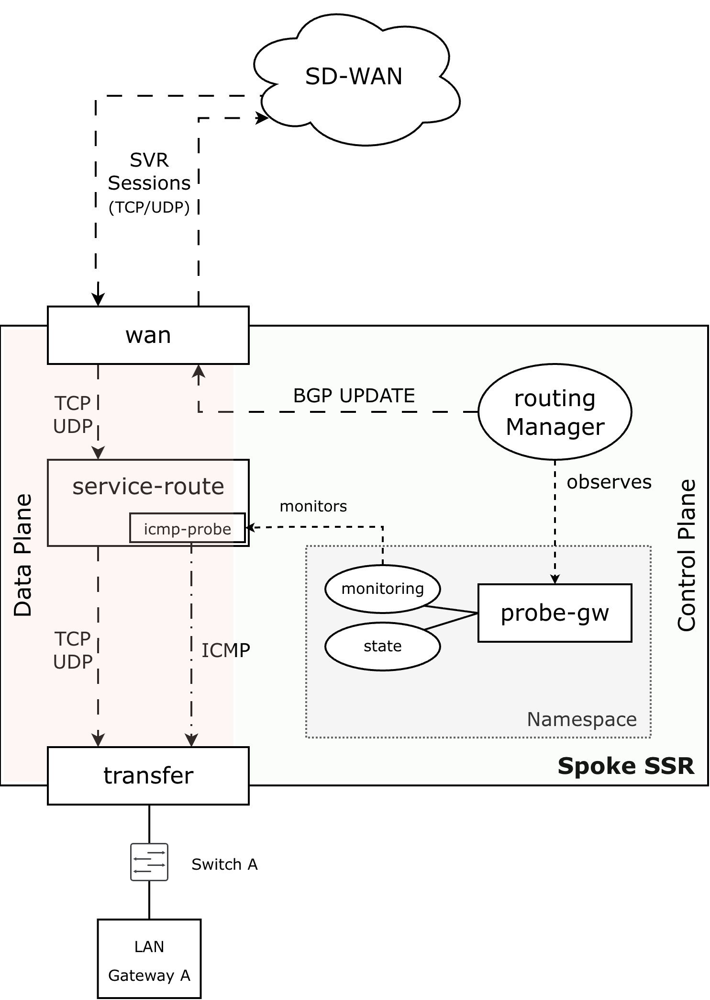
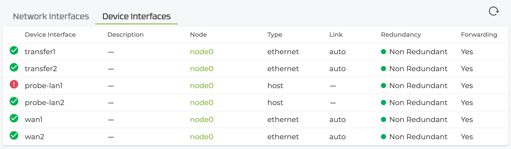

# ssr-icmp-probe-lan

Service-path based LAN reachability tracking for dynamic BGP route advertisement in HPE Networking SSR.

## Overview

Traditional routing platforms support ICMP probing to track destination reachability (for example, a LAN gateway) and dynamically enable or disable static routes based on probe results.

Examples:

* [Juniper's RPM-tracked static routes](https://www.juniper.net/documentation/us/en/software/junos/flow-monitoring/topics/concept/real-time-performance-monitoring-overview.html#id-understanding-using-probes-for-realtime-performance-monitoring-on-m-t-ptx-and-mx-series-rout__subsection_nsx_m3r_zfc)
* [Cisco's Static Route Object Tracking](https://www.cisco.com/c/en/us/td/docs/switches/lan/c9000/lyr3-fwd/enhanced-object-tracking/enhanced-object-tracking-configuration-guide/static-route-object-tracking.html)

HPE Networking Session Smart Routing (SSR) provides [service-path monitoring via ICMP probes](https://www.juniper.net/documentation/us/en/software/session-smart-router/docs/config_service_health/#icmp-probe), but service-path state cannot directly influence BGP route advertisement or withdrawal.

This makes certain high-availability (HA) designs difficult to implement.

**ssr-icmp-probe-lan** bridges this gap.

It uses a virtual router interface (type `host`) whose operational state is controlled by the SSR networking namespace framework. Since BGP advertisements depend on interface state, this enables dynamic advertisement or withdrawal of BGP routes based on LAN reachability.

The SSR networking namespace monitoring script evaluates SSR-native service-path health (ICMP probe results) via the local SSR API:

1. Identify all static routes that use the virtual KNI interface as next-hop
2. Extract the associated destination prefix(es)
3. Find service-routes with reachability-detection enabled and a valid ICMP probe profile
4. Match the linked service address against the static-route prefix
5. Evaluate the corresponding service-path status (icmp-probe successful)

If all requirements are met, the interface is reported **UP**, otherwise **DOWN**.

## Example Use Case

### Scenario

* Two routers (A and B) operate at a branch site
* Connected to an SSR SD-WAN (hub/spoke, optional partial mesh)
* Both advertise the branch prefix(es) via BGP-over-SVR
* Backup router uses:
	* AS-path prepending (eBGP), or
	* Lower local preference (iBGP)

This diagram outlines the topology:



### Failure Handling

* Primary router probes the LAN gateway via ICMP
* Probe results control the virtual interface `probe-lan1`
* If probes fail:
	* `probe-lan1` transitions to **down**
	* The BGP route (e.g. `100.100.128.0/28`) is withdrawn
* Optional: backup router performs the same probing logic
* Optional: DNAT/SNAT hides real LAN prefixes (e.g. 192.168.100.0/24)

The following diagram outlines how **ssr-icmp-probe-lan** is intended to work in this use case.




## Configuration

Configuration requires changes on the conductor (globally and at router level).

### Global Configuration

* Define a LAN service (per branch site)
	* Recommended: restrict visibility similarly

### Router-Level Configuration

* Service-route for LAN service
* Virtual interface (type `host`)
* Static route
	* Next-hop interface = **virtual interface**
	* Ensures BGP advertisement depends on interface state
* Optional:
	* Bidirectional NAT on transfer/LAN interface

⚠ The (global) service referenced by the service-route must contain the same subnet as the static-route destination prefix.

### Sample SSR configuration

```
config
    authority
        router  branch1
            node  node0
                device-interface  transfer1
                    pci-address        0000:00:13.0
                    network-interface  transfer1
                        tenant              corp
                        address             192.168.1.254
                            prefix-length   30
                            gateway         192.168.1.253
                        exit
                        bidirectional-nat   192.168.101.0/29
                            remote-ip  100.100.128.0/29
                        exit
                        dynamic-source-nat  192.168.101.0/24
                            remote-ip  100.100.128.15/32
                        exit
                    exit
                exit
                device-interface  wan1
                    ...
                exit
                device-interface  probe-lan1
                    type               host
                    network-namespace  probe-lan1
                    network-interface  probe-lan1
                        address    192.168.128.1
                            prefix-length  30
                            gateway        192.168.128.2
                        exit
                    exit
                exit
            exit
            routing              default-instance
                interface         loopback_bgp
                    ...
                exit
                routing-protocol  bgp
                    ...
                    redistribute  static
                    exit
                exit
                static-route      100.100.128.0/28 254
                    distance            254
                    next-hop-interface  node0 probe-lan1
                    exit
                exit
            exit
            reachability-profile  probe-lan1
            exit
            icmp-probe-profile    probe-lan1
                probe-address  192.168.101.1
                sla-metrics
                    max-loss  30
                exit
            exit
            service-route        local-network
                service-name  branch1.sites
                next-hop      node0 transfer1
                exit
                reachability-detection
                    enabled               true
                    enforcement           true
                    reachability-profile  probe-lan1
                    probe-type            always
                    probe                 probe-lan1
                        icmp-probe-profile  probe-lan1
                    exit
                exit
            exit
        exit
        service                 sites
            description           "Template service to form sites hierarchy"
            security              app-sec
            access-policy         corp
            exit
            service-policy        failover-wan1-wan2-wan3-wan4
            share-service-routes  false
            application-type      template
        exit
        service                 branch1.sites
            address               100.100.128.0/28
            share-service-routes  false
        exit
    exit
exit

```


## Installation

The **ssr-icmp-probe-lan** files must be installed on each SSR router node that requires the service-path based LAN reachability tracking.

First, place the following files on the conductor under `/srv/salt`:

* ssr-icmp-probe-lan.sls
* ssr-icmp-probe-lan-monitoring.pyz
* ssr-icmp-probe-lan-state.pyz

For the installation there are two options:

### Automatic via `top.sls` (recommended)

Update the `top.sls` - all routers (asset-ids) must be referenced, e.g. `branch1`:

```
$ cat /srv/salt/top.sls
base:
  '*':
    - dummy
  'branch1':
    - ssr-icmp-probe-lan
# ...
```
The installation is performed automatically during the next salt highstate (for example, when the minion reconnects).

### Manual Installation

This works without modifying `top.sls` and applies the salt state directly - for example during tests:

```
$ sudo salt-call -l debug state.apply ssr-icmp-probe-lan
```

⚠ Manual installations must be repeated after router replacement (e.g. RMA).

## Troubleshooting



In general there are status information provided by each virtual host interface. These can be displayed on the PCLI running `show device-interface name <host-interface>` which should look like:

```
admin@node0.branch1# show device-interface name probe-lan1
Wed 2026-02-18 00:00:00 UTC
✔ Retrieving device interface information...

===============================================
 node0:probe-lan1
===============================================
 Type:                host
 Internal ID:         3
 Forwarding:          true
 Mode:                host
 MAC Address:         00:00:de:ad:be:ef

 Admin Status:        up
 Operational Status:  down
 Provisional Status:  up
 Redundancy Status:   non-redundant
 Speed:               0 Mb/s
 Duplex:              unknown

 in-octets:                       12800
 in-unicast-pkts:                   128
 in-errors:                           0
 out-octets:                      12800
 out-unicast-pkts:                  128
 out-errors:                        128

 Error:
   -> Probe failed for service branch1.sites
```

### Typical Issues

#### 1. Virtual interface is down

The error is `Probe failed for service ...`

Check whether the LAN gateway is reachable from the SSR router:

```
# ping egress-interface transfer1 <probe-address>
```

Solution: if the probe-address is not responding, double-check the configuration and physical connections.


#### 2. Packet loss too high

If the packet loss exceeds the max-loss percentage (default: 10), the probe status is `DOWN` even if it looks like that (almost) all pings are responded.

Check if the `exceeded-by-max-loss` value is non-zero:

```
admin@node0.branch1# show stats icmp reachability-probe service-routes
Wed 2026-02-18 00:00:00 UTC
✔ Retrieving statistics...

Stats pertaining to ICMP Probe per Service Route
------------------------------------------------

========================== ======= ==================== =============== =========== ================== ============
 Metric                     Node    Probe-profile-name   Probe-address   Netintf     Next-hop-gateway        Value
========================== ======= ==================== =============== =========== ================== ============
 exceeded-by-max-latency    node0   probe-lan1           192.168.101.1   transfer1   192.168.1.253               0
                            node0   probe-lan2           192.168.102.1   transfer2   192.168.2.253               0
 exceeded-by-max-loss       node0   probe-lan1           192.168.101.1   transfer1   192.168.1.253              12
                            node0   probe-lan2           192.168.102.1   transfer2   192.168.2.253               0
 exceeded-by-mean-latency   node0   probe-lan1           192.168.101.1   transfer1   192.168.1.253               1
                            node0   probe-lan2           192.168.102.1   transfer2   192.168.2.253               0
 jitter                     node0   probe-lan1           192.168.101.1   transfer1   192.168.1.253               0
                            node0   probe-lan2           192.168.102.1   transfer2   192.168.2.253               0
 latency                    node0   probe-lan1           192.168.101.1   transfer1   192.168.1.253               0
                            node0   probe-lan2           192.168.102.1   transfer2   192.168.2.253               0
 loss                       node0   probe-lan1           192.168.101.1   transfer1   192.168.1.253             128
                            node0   probe-lan2           192.168.102.1   transfer2   192.168.2.253               0
 updated                    node0   probe-lan1           192.168.101.1   transfer1   192.168.1.253       128000000
                            node0   probe-lan2           192.168.102.1   transfer2   192.168.2.253       128000000
```

If that is the case it might help to increase the allowed loss in the SSR configuration (e.g. 30 percent):

```
config
    authority
        router  branch1
            icmp-probe-profile    probe-lan1
                sla-metrics
                    max-loss  30
                exit
            exit
        exit
    exit
exit
```

#### 3. Configuration is incomplete

Verify whether the configuration is complete or not:

* A **static-route** to the (DNAT) LAN IP subnet exists and uses the virtual host interface (e.g. `probe-lan1`) as next-hop
* A **service** to the same LAN IP subnet exists and a **service-route** refers to this service and points to the physical LAN interface (e.g. `transfer1`)
* **Reachability-detection** is enabled for that service-route and has a **reachability-profile** and **icmp-probe-profile** assigned to it.

The PCLI command `show device-interface name <host-interface>` should indicate if configuration elements are missing.

#### 4. Downloaded files are incorrect on the conductor

Verify whether the type of the files match the output below:

```
$ file /srv/salt/ssr-icmp-probe-lan*
/srv/salt/ssr-icmp-probe-lan-monitoring.pyz: Zip archive data, made by v2.0 UNIX, extract using at least v2.0, last modified Thu Jan 31 01:58:29 2019, method=store, K\003\004\024
/srv/salt/ssr-icmp-probe-lan-state.pyz:      Zip archive data, made by v2.0 UNIX, extract using at least v2.0, last modified Thu Jan 31 01:58:29 2019, method=store, K\003\004\024
/srv/salt/ssr-icmp-probe-lan.sls:            ASCII text
```